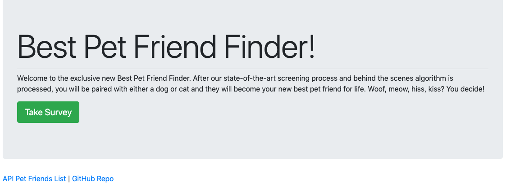

# Best Friend Pet Finder

Welcome to Bamazon! This is an Amazon-like storefront built with MySQL and Node.js. 

Within the customer portal, you can view the inventory, choose an item you'd like to purchase along with the quantity, and voila! Transaction complete! However, if we do not have enough of the selected item in stock deeming us unable to fulfill your purchase, the transaction will not go through.

[GitHub Link](https://github.com/gwyscaver/friendfinder)



# Live Link
- https://gentle-peak-06753.herokuapp.com


# Requirements
1. Modularity in the form of separate files for server logic, storing of best pet friends, views, and routing
2. 10-question survey to assess preference between dog or cat
3. Use `express`, `body-parser`, and `path` npm packages in the `server.js` file
4. Separate JavaScript files for routing (`apiRoutes.js` and `htmlRoutes.js`)
5. Appropriate GET and POST routes for serving HTML pages and API calls
6. Separate file for storing pets (`pets.js`)
7. Calculate best match for user once survey is completed and return that match to the user


# Tech Used
* JavaScript
* jQuery
* node.js
* Express.js
* HTML
* Bootstrap


# Notes

# Code Explanation
* The `server.js` file sets up the Express server, specifying the port number, the npm packages that need to be loaded, and also        the routes, which have been externalized
* There are 2 separate HTML files (`home.html` and `survey.html`) that serve as the front-end portion of the code; they determine       the user views (the homepage and the survey, which the latter will show the resulting best match)
* The 2 routing files (`apiRoutes.js` and `htmlRoutes.js`) determine the back-end logic (based on the request being made, the           response that gets sent to the browser); the HTML routes display the survey and the homepage based on the URL that is              accessed, and the API routes send back existing content on the server-side data or add new pet friends
* Best match is calculated by finding the best pet friend with the minimal difference in scores and then sending that pet friend        to the browser as a JSON object
* A modal is then toggled, displaying the best match to the person who just took the survey
* Best Pet Friends are stored as the following:

```js
{
	name: "George",
	photo: "https://www.akc.org/wp-content/themes/akc/component-library/assets/img/welcome.jpg",
	scores: [5,5,2,3,4,5,2,1,1,5]
}
```


